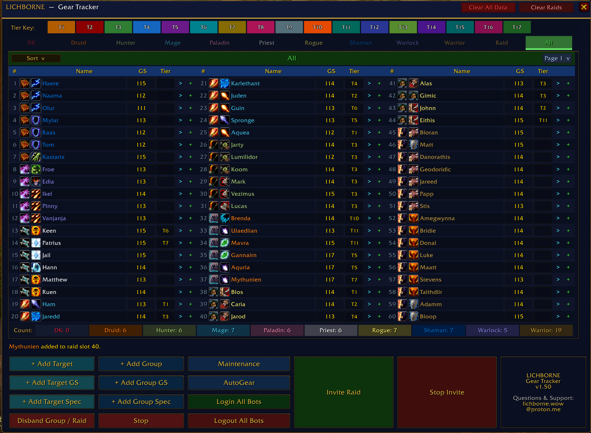
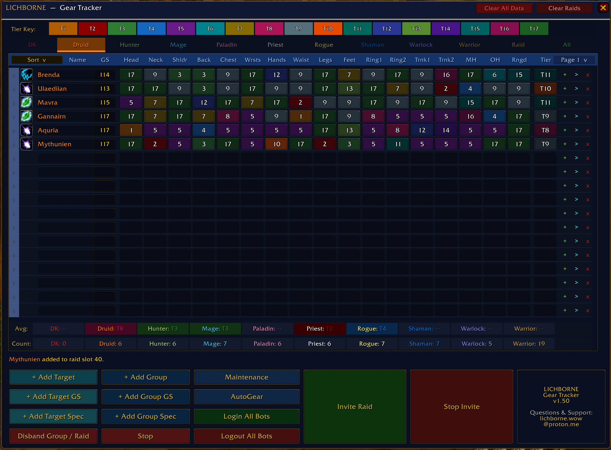
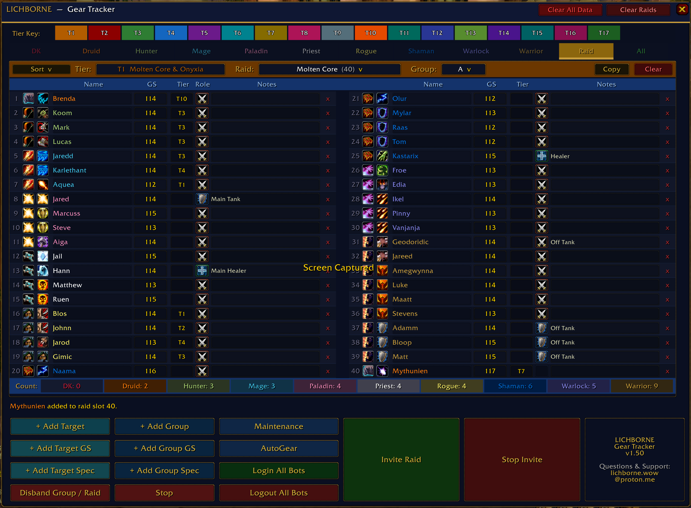

# LICHBORNE — Gear Tracker

### A World of Warcraft WotLK 3.3.5a Addon for AzerothCore Private Servers

**Version 1.50**

---

## Screenshots

**Character Sheet (All Tab)**


**Class Tracker**


**Raid Planner**


---

## Purpose

**LICHBORNE** is a standalone gear tracking addon built for AzerothCore WotLK private servers running the 3.3.5a client. It was designed for server owners and raid leaders who manage large rosters of playerbot characters and need to track gear progression, talent specs, raid assignments, and group composition — all in one window. Named after my WoW private server.

---

## What's New in v1.50

- **ESC key** now minimizes the tracker instead of opening the game menu
- **Minimap icon position** persists correctly across reloads and relogs
- **Sort dropdown** on all tabs — sort by Name, Class/Spec, or Gear Score
- **Copy / Paste roster** — copy any raid roster and paste it into any other raid or group
- **Stop buttons** — cancel a running Invite or GS/Spec scan mid-process
- **Disband Group / Raid** — kicks all members and leaves the group with a confirmation prompt
- **Invite Raid & Stop Invite** now visible on all tabs, not just the Raid tab
- **Deleting a character** from a class tab now automatically removes them from raid rosters
- **GS scan no longer wipes spec data** — getting GS and getting Spec are now fully independent
- **Gold border UI theme** — buttons, content area, and info box unified with a gold border
- **Button redesign** — color-coded columns, gold font throughout, cleaner layout
- Various bug fixes including minimap icon registration timing and sort variable scoping

---

## Features

### Class Tabs

Each of the 10 playable classes has its own tab with up to **54 roster slots** across **3 pages**. Each character row tracks:

* **Spec icon** — auto-detected from talent inspection
* **Name** — editable
* **Gear Score** — calculated from item levels via inspect
* **17 gear slots** — Head, Neck, Shoulders, Back, Chest, Wrists, Hands, Waist, Legs, Feet, Ring 1, Ring 2, Trinket 1, Trinket 2, Main Hand, Off Hand, Ranged
* **Tier rating** — color-coded T1 through T17
* **Add to Raid** (+) and **Invite to Group** (>) buttons per row

#### Page Switching

Each class tab has a **Page dropdown** (top-right of the header) letting you switch between Page 1, 2, and 3. Characters fill pages in order — adding a new character always finds the next empty slot across all pages and jumps you to the right page automatically.

#### Sort Dropdown

Every tab has a **Sort** dropdown at the top-left of the header bar. Options:

* **By Name** — alphabetical
* **By Class / Spec** — groups by spec within class
* **By Gear Score** — highest GS first

#### Bottom Controls (Class Tabs)

* **+ Add Target** — Inspects your current target and adds them to their class tab
* **+ Add Group** — Inspects all group/raid members and bulk-adds them
* **+ Add Target GS** — Refreshes gear score for your current target (does not affect spec)
* **+ Add Target Spec** — Reads talent spec for your current target (does not affect GS)
* **+ Add Group GS** — Refreshes gear score for all group members (~2.5s per player)
* **+ Add Group Spec** — Reads talent spec for all group members (~3s per player)
* **Stop** — Cancels a running GS or Spec scan immediately
* **Maintenance** — Sends `maintenance` to group chat (bots learn spells, repair, enchant)
* **AutoGear** — Sends `autogear` to group chat (bots equip best available gear)
* **Login All Bots** — Logs in all playerbot characters (`.playerbots bot add *`)
* **Logout All Bots** — Logs out all playerbot characters (`.playerbots bot remove *`)
* **Disband Group / Raid** — Kicks all members then leaves the group. Requires confirmation.
* **Invite Raid** — Visible on all tabs. Runs the full bot invite sequence
* **Stop Invite** — Cancels the running invite sequence immediately

#### Summary Bars

At the bottom of every class tab:

* **Avg bar** — shows average tier rating per class across all tracked characters
* **Count bar** — shows total tracked character count per class

---

### Raid Tab

Plan and manage your raid roster with up to **40 slots** across two columns. Supports multiple saved rosters for different raids and groups.

Each raid slot shows:

* Class icon, spec icon, name, gear score, tier, **role** (Tank/Healer/DPS), notes, and a delete (x) button

#### Raid Controls

At the top of the Raid tab:

* **Sort** — sort raid roster by Name, Class/Spec, or Gear Score
* **Tier dropdown** — select raid tier (T1–T17)
* **Raid dropdown** — select the raid instance (Molten Core, BWL, AQ40, Naxx, ICC, etc.)
* **Group dropdown** — switch between Group A, B, C for the selected raid
* **Copy** — copies the current roster to a session clipboard
* **Paste** — appears after copying; prompts confirmation before pasting. Disappears after one use
* **Clear** — clears the current roster with a confirmation prompt

#### Copy / Paste Roster

1. Navigate to the source roster (any tier, raid, group)
2. Click **Copy** — status bar confirms: *"Roster copied to clipboard: T1 Molten Core (A)"*
3. Navigate to the destination roster
4. Click **Paste** — prompt shows: *"Copy T1 Molten Core (A) roster to T3 Karazhan (B)?"*
5. Click **Yes, Paste** — all slots are filled, status bar shows *"Roster copied!"*

The clipboard is session-only (cleared on reload). Paste disappears after one use.

#### Invite Raid Button

Appears when a raid roster is selected (T1+). Click to automatically:

1. Log out all current bots by name
2. Leave your current party
3. Wait 2 seconds for bots to clear
4. Invite the first bot and create the group
5. Convert to raid
6. Invite remaining bots with 0.8s gaps
7. Wait 3 seconds then verify who joined
8. If anyone was missed: individually removes then re-adds them

#### Invite Group Button

Same as Invite Raid but for 5-man groups — skips the raid conversion step.

---

### All Tab

A master view showing **all tracked characters** across all classes in a 3-column layout of 20 rows each (60 characters per page).

* **Sort** — sort by Name, Class/Spec, or Gear Score
* **Page dropdown** — switch between Page 1, 2, and 3 (60 characters each, 180 total)
* Characters sync automatically from your class tabs
* Count bar shows totals across all pages

---

## Installation

1. Download the zip and extract it
2. Drag the **`LichborneTracker`** folder into:
```
World of Warcraft/Interface/AddOns/
```
3. Launch WoW and type `/lichborne` or `/lbt`, or click the minimap icon

**Requirements:**

* WoW client: **3.3.5a** (WotLK)
* Server: **AzerothCore** with Playerbot module enabled

---

## How To Use

### First Time Setup

1. Open the tracker with `/lichborne`
2. Target a character you want to track
3. Click **+ Add Target** — inspects them and adds them to their class tab
4. Repeat for all characters, or use **+ Add Group** while in a group with them

### Tracking Gear

* Click **+ Add Target GS** while targeting someone to update their gear score
* Click **+ Add Group GS** to update everyone in your current group at once
* Gear slots are manually edited by clicking the boxes in each row and entering the tier number of the drop. For example: an item drops in Molten Core (T1), enter `1` in that slot for the character who got it. This tracks progression across 17 tiers taken from the individual progression mod used in 3.3.5a.

### Building a Raid Roster

1. Switch to the **Raid tab**
2. Select your tier and raid from the dropdowns
3. Use the **+** button on any character row to add them to the raid
4. Assign roles and notes to each slot
5. Click **Invite Raid** to automatically form the group

### Copying a Roster

1. Navigate to the source roster (Raid tab → select tier/raid/group)
2. Click **Copy**
3. Switch to the destination raid/group
4. Click **Paste** and confirm

### Disbanding

Click **Disband Group / Raid** (bottom-left of any tab). After confirming, the addon kicks every member and leaves the group.

---

## Data & Saved Variables

All data is stored in WoW's SavedVariables system under `LichborneTrackerDB` and `LichborneMinimapIconDB`. This persists across sessions. The **Clear All Data** button (top-right) permanently deletes all tracked characters, gear data, and raid rosters.

---

## Known Limitations

* Gear inspection requires the target to be **nearby** (~28 yards)
* Talent spec reading requires the target to be in your group or nearby
* `NotifyInspect()` is rate-limited by the WoW client — bulk operations space out automatically
* Playerbot commands are sent via SAY chat and require you to be the bot owner
* The roster clipboard is session-only and is lost on `/reload`

---

## Credits

Shoutout to **Dohtt** for the feature suggestions that made v1.50 better!


Built for the **Lichborne** AzerothCore private server.

Questions & Support: **lichborne.wow@proton.me**

*If this addon is useful to you, feel free to share it.*

---

*Compatible with WoW 3.3.5a (build 12340) | AzerothCore | Playerbot Module*
